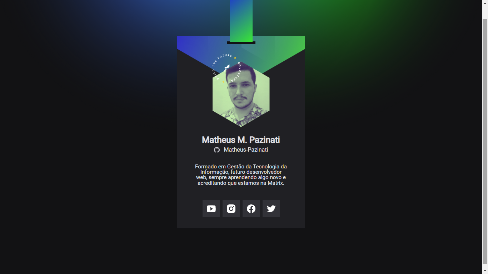

<h1 align="center">Crachá DoWhile 2021 </h1>

  

 
<h2>💻 Sobre </h2>

Projeto desenvolvido durante a Next level week (NLW) da Rocketseat, um crachá para participar do evento DoWhile2 2021, que acontece em dezembro. 
Você pode acessar o site do projeto através deste link: <a href="https://matheus-pazinati.github.io/badge-nlw/">Crachá DoWhile 2021</a>
 

 
<h2>🎯 Objetivo </h2>

Criar um projeto onde eu consiga mostrar algumas informações no crachá (foto, nome, links, biografia) consumindo a API do Github.

 
<h2>🚀 Tecnologias utilizadas</h2>
<ul>
  <li>HTML</li>
  <li>CSS</li>
  <li>Javascript</li>
</ul>
 
<h2>🏷️ Layout</h2>

Você pode visualizar o layout do projeto através deste link: <a href="https://www.figma.com/community/file/1031698737363668691">Layout do projeto</a>. É necessário possuir uma conta no <a href="https://figma.com">Figma</a> para acessá-lo.

 
 

Made by Matheus Pazinati 🛸
